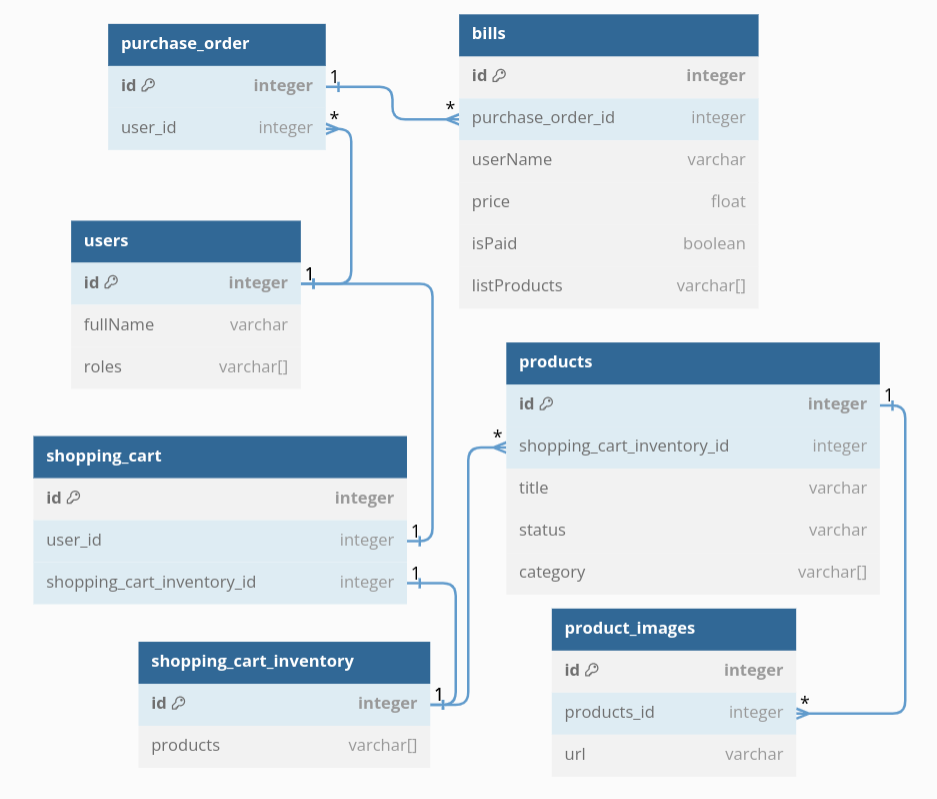

- cd into this project and run 'yarn'
- Create "betacode_store" DB in postgres
- Create a .env based on env.example
- Use the Insomnia JSON to check the endpoints
- yarn start:dev

This app has this features:
- JWT
- Login 
- Producs
- Search for producs
- Route protection
- Custom Guards

(DB is a work in progres, it should look like this)


Created in https://dbdiagram.io

Just copy and paste this in https://dbdiagram.io to edit the ERD:
```
Table users {
  id integer [primary key]
  fullName varchar
  roles varchar[]
}

Table products {
  id integer [primary key]
  shopping_cart_inventory_id integer
  title varchar
  status varchar
  category varchar[]
}

Table product_images {
  id integer [primary key]
  products_id integer
  url varchar
}

Table shopping_cart {
  id integer [primary key]
  user_id integer
  shopping_cart_inventory_id integer
}

Table shopping_cart_inventory {
  id integer [primary key]
  products varchar[]
}

Table bills {
  id integer [primary key]
  purchase_order_id integer
  userName varchar
  price float
  isPaid boolean
  listProducts varchar[]
}

Table purchase_order {
  id integer [primary key]
  user_id integer
}

Ref: users.id - shopping_cart.user_id
Ref: bills.purchase_order_id > purchase_order.id
Ref: product_images.products_id > products.id
Ref: shopping_cart_inventory.id < products.shopping_cart_inventory_id
Ref: shopping_cart.shopping_cart_inventory_id - shopping_cart_inventory.id
Ref: users.id < purchase_order.user_id
```
